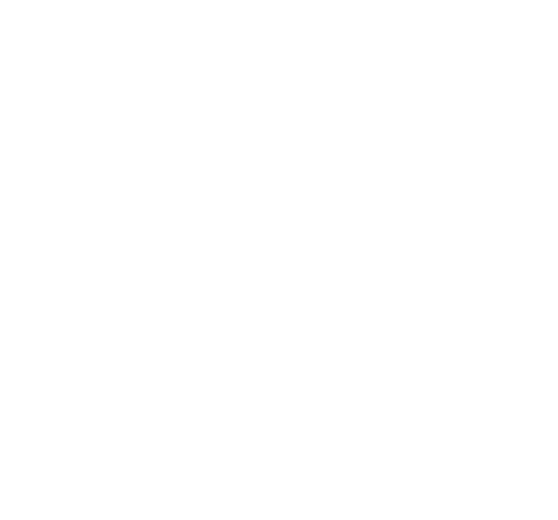

<div align="center">
  
  
  # NOÉTIC STUDIO
  ### *Creative Intelligence for the Next Frontier*
  
  [](https://noetic-studio.thenoeticstudio.workers.dev)
  [](https://nextjs.org)
</div>

---

## 👁️ The Vision

NOÉTIC is a multidisciplinary creative agency that operates at the intersection of **Design**, **Technology**, and **Human Intelligence**. We don't just build websites; we architect digital experiences that resonate, inspire, and drive measurable growth.

Our philosophy, **"Creative Intelligence,"** represents our commitment to blending raw artistic vision with data-driven strategy.

## 🛠️ Core Capabilities

- **Brand Identity**: Crafting visual languages that tell a story before a single word is read.
- **Experience Design**: High-performance digital interfaces that feel alive and responsive.
- **Marketing Strategy**: Precision-targeted campaigns that cut through the noise of the modern web.
- **Creative Tech**: Leveraging the latest in Edge computing and motion design to push browser boundaries.

## 🚀 The Stack

This project is built using a bleeding-edge stack designed for maximum performance and premium aesthetics:

- **Framework**: [Next.js 16 (React 19)](https://nextjs.org)
- **Styling**: [Tailwind CSS 4](https://tailwindcss.com) & Vanilla CSS
- **Animation**: [Framer Motion](https://framer.com/motion) for high-fidelity interactive physics.
- **Deployment**: [Cloudflare Workers](https://workers.cloudflare.com/) via `@opennextjs/cloudflare`.
- **Backend**: [Supabase](https://supabase.com) (Auth, Database, Storage).
- **Icons**: [Lucide React](https://lucide.dev).

## 📦 Getting Started

### Prerequisites

- Node.js 20+
- npm / pnpm / bun

### Installation

```bash
git clone https://github.com/Taxmiddd/Noetic-Studio.git
cd Noetic-Studio
npm install
```

### Local Development

```bash
npm run dev
```

### Production Preview & Deployment

This project uses **OpenNext** for best-in-class Cloudflare Workers integration.

```bash
# Preview the production build locally via Wrangler
npm run preview

# Deploy to Cloudflare Workers
npm run deploy
```

---

<div align="center">
  <p>© 2026 NOÉTIC STUDIO. All rights reserved.</p>
</div>
